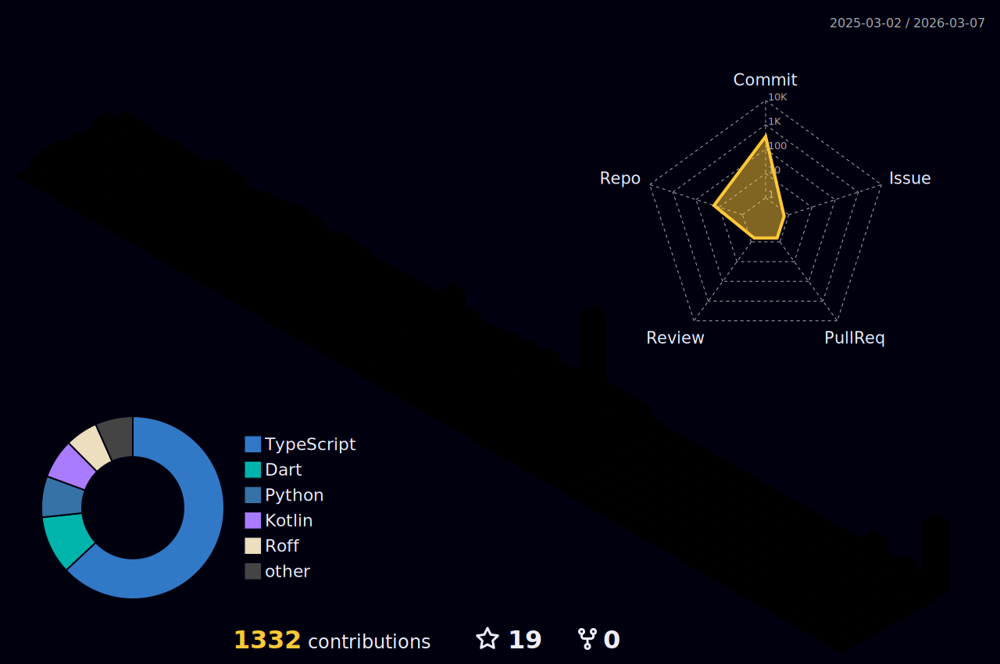

<div align="center">
  
</div>

<p align="center">
  <a href="https://www.linkedin.com/in/ayush-jha-1711b537a/">
    
  </a>
  <a href="mailto:codewithayuu@gmail.com">
    
  </a>
  <a href="https://www.instagram.com/ayushjha.exe/">
    
  </a>
  <a href="https://github.com/codewithayuu?tab=repositories">
    
  </a>
</p>

<br>


<p align="left">
  
  &nbsp;
  
  &nbsp;
  
</p>

---

### 🖥️ `> whoami`

```js
const ayush = {
    pronouns: "he" | "him",
    location: "India 🇮🇳",
    role: "CS Student & Full-Stack Developer",
    currentlyWorkingOn: "Cool projects & open-source contributions",
    learning: ["React.js", "Next.js", "Rust", "Kotlin"],
    askMeAbout: ["Node.js", "MongoDB", "MySQL", "Linux", "Open Source"],
    email: "codewithayuu@gmail.com",
    funFact: "My first line of code was NOT 'Hello World!' 😄",
    availableForHire: true,
};
```

<br clear="both">

---

## 🚀 Tech Arsenal

<div align="center">
  <br>
  <br>
  
</div>

<details>
<summary>📋 <b>Expand for detailed breakdown</b></summary>
<br>

| Category | Technologies |
|:--------:|:------------|
| **Languages** |        |
| **Frontend** |     |
| **Backend** |   |
| **Databases** |     |
| **DevOps & Tools** |      |

</details>

---

## 🎮 Play Tic-Tac-Toe

> **Click any ⬜ square to make your move!** You play as ❌, I play as ⭕  
> _Each click opens a GitHub Issue — just hit "Submit" and the board updates automatically!_

<!-- TICTACTOE_STATE:_________ -->
<!-- TICTACTOE_BOARD_START -->

|   | **1** | **2** | **3** |
|:---:|:---:|:---:|:---:|
| **A** | [⬜](https://github.com/codewithayuu/codewithayuu/issues/new?title=tictactoe%7CA1&body=Just+click+submit!) | [⬜](https://github.com/codewithayuu/codewithayuu/issues/new?title=tictactoe%7CA2&body=Just+click+submit!) | [⬜](https://github.com/codewithayuu/codewithayuu/issues/new?title=tictactoe%7CA3&body=Just+click+submit!) |
| **B** | [⬜](https://github.com/codewithayuu/codewithayuu/issues/new?title=tictactoe%7CB1&body=Just+click+submit!) | [⬜](https://github.com/codewithayuu/codewithayuu/issues/new?title=tictactoe%7CB2&body=Just+click+submit!) | [⬜](https://github.com/codewithayuu/codewithayuu/issues/new?title=tictactoe%7CB3&body=Just+click+submit!) |
| **C** | [⬜](https://github.com/codewithayuu/codewithayuu/issues/new?title=tictactoe%7CC1&body=Just+click+submit!) | [⬜](https://github.com/codewithayuu/codewithayuu/issues/new?title=tictactoe%7CC2&body=Just+click+submit!) | [⬜](https://github.com/codewithayuu/codewithayuu/issues/new?title=tictactoe%7CC3&body=Just+click+submit!) |

> 🎮 **New game — Click any square to start playing!**

<!-- TICTACTOE_BOARD_END -->

<details>
<summary>🕹️ <b>More games to play</b></summary>
<br>

<p align="center">

| Game | Play Now |
|:----:|:--------:|
| 🐍 Snake | [Play Google Snake](https://www.google.com/fbx?fbx=snake_arcade) |
| 🧱 2048 | [Play 2048](https://play2048.co/) |
| 💣 Minesweeper | [Play Minesweeper](https://minesweeper.online/) |
| 🟦 Tetris | [Play Tetris](https://tetris.com/play-tetris) |
| 🎯 Aim Trainer | [Play Aim Trainer](https://humanbenchmark.com/tests/aim) |
| ⌨️ Typing Speed | [Test Typing Speed](https://monkeytype.com/) |
| 🧩 Sudoku | [Play Sudoku](https://sudoku.com/) |

</p>
</details>

---

##  GitHub Stats Dashboard

<p align="center">
  
  
</p>

<p align="center">
  
</p>

<details>
<summary>📊 <b>Expand for more detailed stats</b></summary>
<br>

<p align="center">
  
  
</p>

<p align="center">
  
  
</p>

<p align="center">
  
</p>

</details>

---

## 🏆 GitHub Trophies

<p align="center">
  <a href="https://github.com/ryo-ma/github-profile-trophy">
    
  </a>
</p>

---

## 📈 Contribution Graph

<p align="center">
  
</p>

---

## 🧊 3D Contribution Calendar

<p align="center">
  <picture>
    <source media="(prefers-color-scheme: dark)" srcset="./profile-3d-contrib/profile-night-rainbow.svg" />
    <source media="(prefers-color-scheme: light)" srcset="./profile-3d-contrib/profile-south-season-animate.svg" />
    
  </picture>
</p>

---

## 🐍 Watch the Snake Eat My Contributions

<p align="center">
  <picture>
    <source media="(prefers-color-scheme: dark)" srcset="https://raw.githubusercontent.com/codewithayuu/codewithayuu/output/github-snake-dark.svg" />
    <source media="(prefers-color-scheme: light)" srcset="https://raw.githubusercontent.com/codewithayuu/codewithayuu/output/github-snake.svg" />
    
  </picture>
</p>

---

<!--
## 🎵 Spotify — Now Playing

<p align="center">
  <a href="https://open.spotify.com/user/YOUR_SPOTIFY_USER_ID">
    
  </a>
</p>

> 📝 To activate: Go to https://spotify-github-profile.kittinanx.com → Login with Spotify → Replace YOUR_SPOTIFY_USER_ID above
-->

<!--
## ⌨️ Weekly Coding Stats (WakaTime)

<p align="center">
  
</p>

> 📝 To activate: Sign up at https://wakatime.com → Install VS Code extension → Replace YOUR_WAKATIME_USERNAME above
-->

---

## 📌 Featured Projects

<p align="center">
  <a href="https://github.com/codewithayuu/codewithayuu">
    
  </a>
  <!-- Add more pinned repos below 👇 -->
  <!--
  <a href="https://github.com/codewithayuu/YOUR-REPO-NAME">
    
  </a>
  -->
</p>

---

## 💡 Dev Quote of the Day

<p align="center">
  
</p>

## 😂 Random Dev Joke

<p align="center">
  
</p>

---

##  Party Parrots!

<div align="center">
  
  
  
  
  
  
  
  
  
  
  
  
  
  
  
  
  
  
  
  
  
  
  
</div>

---

<div align="center">

### 🌟 If you like my work, consider giving a ⭐!

<a href="https://skyline.github.com/codewithayuu">
  
</a>

</div>


<p align="center">
  Credit: <a href="https://github.com/codewithayuu">codewithayuu</a> | Last Edited: 28/09/2025
</p>
```