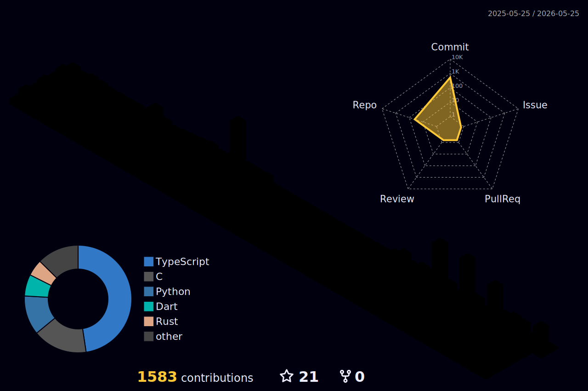

  
  
  
  

---

### About

First-year B.Tech (IT) student at MAIT Delhi building at the boundary of systems programming, decentralized identity, and compiler infrastructure. I ship across the full stack — from low-level Rust and WASM runtimes to SSI portals and RISC-V toolchains — driven by first-principles thinking and a bias toward minimal, correct engineering.

- 🦀 **Primary:** Rust — systems, WASM, CLI, QUIC
- 🌐 **Web:** TypeScript, Next.js, React, Node.js
- 🧠 **ML:** Python, Neural Nets, Signal Processing
- 📍 New Delhi, India

---

### Projects

| Project | Description | Stack |
|:--------|:------------|:------|
| **[DID Vault](https://github.com/codewithayuu)** | Self-sovereign identity portal — DID creation, W3C VC issuance, DIDComm v2 messaging | TypeScript · Next.js · Hyperledger Identus |
| **[Solang Lens](https://github.com/codewithayuu)** | Comparative semantic analyser between Hyperledger Solang and Soroban Rust SDK | Rust · Compiler IR · WASM · ABI |
| **[RVForge](https://github.com/codewithayuu)** | RISC-V cross-compilation harness for high-precision numerical libraries | Rust · C++ · RISC-V · QEMU · CMake |
| **[Skynet](https://github.com/codewithayuu)** | Zero-setup E2E encrypted P2P file transfer via QUIC — no cloud, no accounts | Rust · QUIC · P2P · TUI |
| **[Lumina](https://github.com/codewithayuu)** | Transforms Git repos into interactive blogs with offline WASM code execution | Rust · WASM · TypeScript |
| **[Conquerors](https://github.com/codewithayuu)** | Rust command centre for AI agents — context compression, MCP server, TUI | Rust · CLI · MCP · AI Agents |
| **[Project Chronos](https://github.com/codewithayuu)** | Entropy-aware ICU early-warning system via neural signal processing | Python · ML · Healthcare AI |

---

### Hackathons

| Event | Result |
|:------|:-------|
| HackwithMAIT 6.0 — MAIT | 🏆 Top 5 / 2000 Teams |
| Fortune'26 — DTU (Paytm) | 🏆 Top 5 / 2500 Teams |
| XenoThon'26 — GTBIT | 🏆 Top 5 / 3000 Teams |
| Graph-E-Thon 3.0 — Unstop | 🏆 Top 10 / 4000 Teams |
| Devcation Hack 'N' Solve — Unstop | 🏆 Finalists / 3000+ Teams |

---

### Tech Stack

  
   
  

---

### GitHub Stats

  

  
  

---

